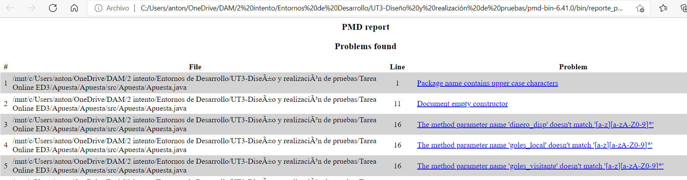

## Probar tu código con PMD y linea de comandos
```code
pmd-bin-6.41.0/bin$ ./run.sh pmd -dir ../../Tarea\ Online\ ED3/Apuesta -f html -R rulesets/java/quickstart.xml >reporte_pmd.html
```

### Parámetros
Es fácil deducir, ***f*** tipo de fichero, en este caso html. ***-R*** es el conjunto de reglas a aplicar.
Y por útlimo el fichero de destino.


