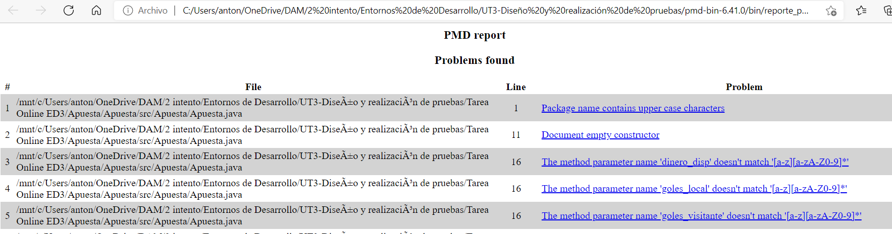

## Expresiones regulares, patrones..
Las expresiones regulares son una forma de descrbir un conjunto de cadenas basadas en ciertas características comunes. Se usan para buscar, manipular y editar texto y datos.

### Paquete ```java.util.regex.```.
Este paquete se compone principalmente de tres clases ***Patter***,***Matcher*** y ***PatternSyntaxExeption***.

#### Pattern
Es una representación compilada de una expresión regular. Esta clase no tiene constructor (público), así que para crear un patrón se debe invocar a uno de sus métodos, en concreto al método ```compile``` que devuelve un objeto tipo Pattern.
```
Pattern patron = new Pattern.compile([a-z]);
```

#### Matcher
Es el motor que interpreta al patrón y realiza operaciones de coincidencia con una cadena de entrada. Tampoco tiene constructor, así que se invoca al método ```matcher``` o ´´´find´´´ para obtener un objeto.

#### PatternSyntaxExeption 
Emite los errores de sintáxis en un patron de expresiones regulares.



