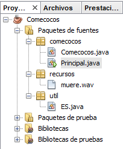

# Tarea Online 3
La tarea que se plantea consiste en la programación de unas clases con una estructura todavía bastante básica y también el trabajo con constructores y parámetros. La estructura recomendada para el proyecto es la que figura en la imagen. La clase ES te la puedes descargar en el apartado: Recursos necesarios. Las clases de nuestro proyecto son:

 

  Una clase Comecocos, una versión todavía muy básica, pero que nos permitirá crear objetos de tipo Comecocos, y hacer operaciones básicas con ellos. Pensaremos en ella de forma aislada, como si su única finalidad fuera permitirnos crear un objeto comecocos, y manipularlo para realizar alguna operación, tal como avanzar o cambiar su dirección, etc.

  Una clase ES, que es una clase contenedora de métodos útiles, que nos permitan realizar operaciones de Entrada y Salida básicas sin tener que volver a preocuparnos de controlar los errores de entrada por teclado, evitando que produzcan que la aplicación aborte cuando se introduce algún valor de un tipo distinto a lo que se espera, y permitiéndonos realizar de forma más cómoda algunas operaciones de salida.

  Por una vez, vamos a incumplir el convenio de formación de nombres de clases, que aconsejaría que la clase se llamara EntradaSalida o algo similar, pero en este caso, nos interesa especialmente que el nombre sea tan corto y sintético como sea posible para simplificar la escritura de los programas, dado que es una clase que usaremos intensivamente a lo largo de varias unidades del curso, y abreviar su escritura, nos va a ahorrar bastante trabajo. Solo tendrás que añadir un método más para leer fechas. Es importante que mires y estudies los métodos que ya se te dan hechos, para que comprendas como están programados. Una manera muy buena de aprender a programar es precisamente viendo código ya hecho de otra gente.

  Una clase Principal, que será desde donde arranca el programa y se gestionan las opciones del menú del programa.

  Por tanto, las actividades a realizar se centrarán en la creación de la clase Comecocos, la definición y utilización de métodos básicos en dicha clase, e implementar la clase Principal siguiendo estos pasos:

Usando NetBeans, crea el proyecto, con la estructura que ves en la imagen de la derecha, y teniendo en cuenta lo suministrado en el apartado de recursos de la tarea, de modo que en la clase Comecocos se definan los atributos necesarios tal y como se listan a continuación, sabiendo que un comecocos tendrá una posición x, una posición y, así como una direccion. Es recomendable que tengas en cuenta las siguientes consideraciones:
El atributo x corresponde a la coordenada x que ocupa el comecocos en la pantalla.
El atributo y corresponde a la coordenada y que ocupa el comecocos en la pantalla.
El atributo direccion corresponde a la dirección a la que se dirige el comecocos. Debe ser un enumerado con los siguientes valores: NORTE, SUR, ESTE, OESTE.
Añade a la clase Comecocos del proyecto creado en el punto anterior, los métodos consultores o de acceso (también llamados métodos get o simplemente getters) y métodos modificadores (también llamados métodos set o simplemente setters) que faltan para poder consultar y modificar el valor de todos los atributos de un comecocos. Los métodos set y get se verán más adelante, pero fíjate que la idea de get es devolver el valor y la del set es establecer el valor. Puedes consultar esta breve reseña: get y set en Java.

Crea ahora un método constructor, sin parámetros, para la clase Comecocos, que permita crear una instancia de tipo Comecocos con los siguientes valores "por defecto" para sus atributos:

```bash
x <-- 0 
y <-- 0 
direccion <-- NORTE
```

1. Crea un nuevo constructor con parámetros para la clase Comecocos que inicialize los atributos del objeto con los valores que se le pasen como parámetros al invocar al constructor para crear un nuevo objeto, mediante el operador new. De momento, aquí no tienes que crear el objeto ni usar new, sólo tienes que definir el método para que posteriormente eso sea posible.
2. Crea un método toString() que devuelva un String indicando su valores, por ejemplo: Coordenadas x=4, y=14, con direccion=SUR, que usarás cuando tengas que mostrar los datos del comecocos.
3. Crea un método giraDerecha() para la clase Comecocos. Este método se encarga de girar el comecocos hacia la derecha. Es decir, si por ejemplo se está en la dirección NORTE, cuando se ejecute este método, la dirección que va a tener el objeto será ESTE, resultado de sumar 90 a los grados. O sea, como tenía NORTE, que son 0 grados, si sumamos 90 grados estamos girando a la derecha, y así para el resto de casos. Lógicamente, cuando al sumar 90 nos dé 360, entonces la dirección resultante será de nuevo la equivalente a 0, o sea, NORTE.
4. Crea un método giraIzquierda() para la clase Comecocos. Similarmente al anterior, este método gira el comecocos hacia la izquierda. Es decir, si por ejemplo se está en la dirección NORTE, cuando se ejecute este método, la dirección que va a asignarse al objeto será OESTE, resultado de restar 90 a los grados. O sea, como era 0 grados, si restásemos 90 grados estamos girando a la izquierda, y así para el resto de casos. Lógicamente, cuando al restar 90 nos dé -90, entonces la dirección resultante será de nuevo la euivalente a 270, o sea, OESTE.
5. Crea un método Avanzar, también para la clase Comecocos, que recibirá como parámetro el número de pasos que debe avanzar el comecocos. Este método simplemente tendrá que comprobar la dirección actual del comecocos, y según sea ésta, incrementar o decrementar la coordenada que corresponda. Así, por ejemplo, si la dirección actual del objeto comecocos es ESTE, y el método recibe 10 como parámetro, es decir, que tiene que avanzar 10 pasos, lo que tendría que hacer el método es sumar 10 a la posición x del objeto.Y así similarmente para los otros casos.
6. Crea un método gradosAdireccion(int grados), que devolverá una dirección. Es decir, este método recibirá como parámetro un entero, y devolverá una dirección NORTE si el entero que recibió era 0, devolverá ESTE si recibión un 90, retornará 180 si recibió SUR, y en caso contrario, devolverá OESTE.
7. Crea un método direccionAgrados(Direccion dir), que devolverá el valor 0 si la dirección recibida como parámetro es NORTE, devolverá 90 si se recibió una dirección ESTE, devolverá 180 si se reicibó SUR y en caso contrario, devolverá 270.
8. Incluye en la clase Comecocos también, un método: void reproducirSonido(String nombreSonido), que recibirá como parámetro una cadena con el nombre del fichero de sonido a reproducir. La forma de hacerlo es muy fácil, puedes verlo en este enlace, fíjate cómo se capturan las excepciones por si, por ejmplo, no existe el fichero de sonido en la ruta suministrada.
9. Incluye comentarios Javadoc en la clase clase Comecocos para que sea posible generar de forma totalmente automática una documentación completa de las clases incluyendo documentación completa de todos sus métodos.
10. Crea una clase Principal, que será la que usará las clases Comecocos y ES. El método main() de esta clase principal, lo que debe hacer primeramente es pedir por teclado las posiciones x e y del comecocos, así como los grados de la dirección de partida, por tanto, se espera que el usuario introduzca 0, 90, 180 o bien 270. Si no introduce como grados uno de esos datos, el programa terminará la ejecución. Por el contrario, si introduce un valor de grados permitido, entonces el programa creará el objeto comecocos mediante el constructor con parámetros, escribirá la posición inicial y se invocará a un método para controlar al comecocos, en función de las entradas por teclado. Como en este ejemplo de ejecución del programa, donde el usuario introduce un número de grados incorrecto, en concreto 88:


```bash
Introduce la posición x del comecocos: 
10
Introduce la posición y del comecocos: 
20
Introduce la dirección del comecocos (0, 90, 180, 270): 
88
Juego terminado, no introdujo los grados correctamente.  
```
Otro ejemplo de ejecución, esta vez el usuario introduce un valor correcto al principio, podría ser:

```bash
Introduce la posición x del comecocos: 
45
Introduce la posición y del comecocos: 
80
Introduce la dirección del comecocos (0, 90, 180, 270): 
90
El comecocos recién creado está en: Coordenadas x=45, y=80, con direccion=ESTE

Escriba:
0-> Avanzar 10 pasos.
1-> Girar a la derecha.
2-> Girar a la izquierda.
3-> Emitir sonido.
4-> Salir del programa. 
```
Y en ese caso, como vemos, el programa ha creado el objeto comecocos, informa sobre ello y muestra las opciones disponibles, esperando a que el usuario introduzca uno de esos valores.
Si entonces, le damos a la opción de avanzar, lo que el programa informará será:
El comecocos está en: Coordenadas x=55, y=80, con direccion=ESTE

```bash
Escriba:
0-> Avanzar 10 pasos.
1-> Girar a la derecha.
2-> Girar a la izquierda.
3-> Emitir sonido.
4-> Salir del programa. 
```
El cuerpo con los comentarios de la clase principal, que te puede ayudar a implementarla, lo puedes descargar de la sección de recursos necesarios.
Obviamente, la opción de emitir el sonido invocará al método necesario para que suene el sonido que indicamos en la sección de recursos necesarios.

Y finalmente, si elegimos la última opción, la cuarta, el programa finalizará la ejecución del mismo.

Recuerda usar el método o métodos que necesites de la clase ES para la lectura del número de opción, eso te evitará que se produzcan excepciones indeseadas.
