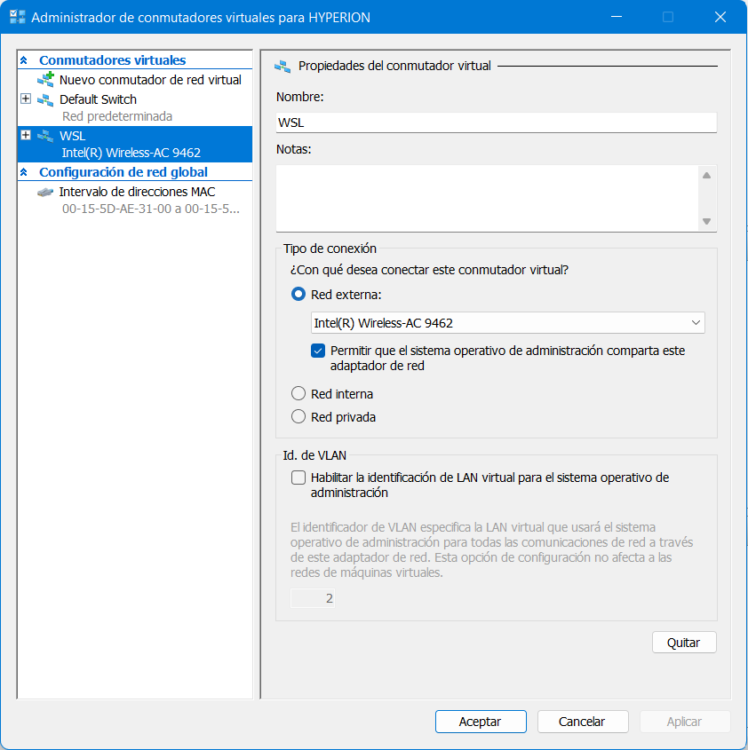
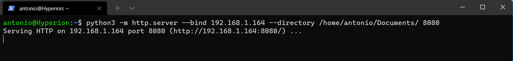
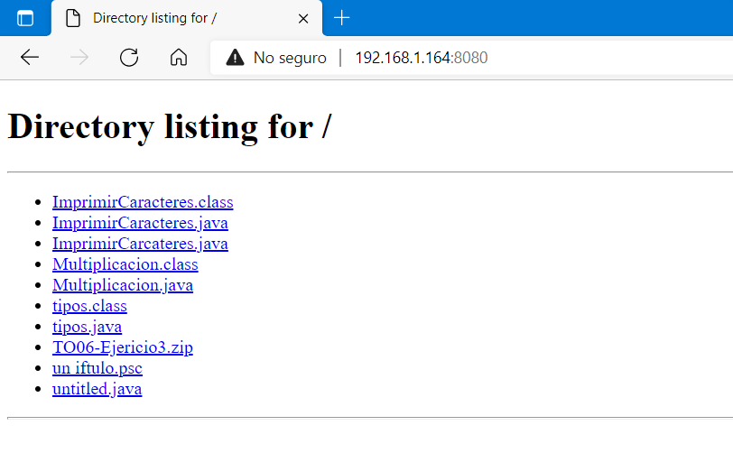

# Iniciar un servidor http en mi WSL con Pyton3

## Configurar la red del subsistema linux de windows.

Para configurar la red de nuestra distribuciÃn linux instalada en nuestro sistema Windows®
tendremos que acceder a la consola de administracion de Hyper-V. Se deberá corre con [!TIP] *privilegios de ad mdinistrador*.
Una vez conectado al servidor, que debe ser nuestramÃquina local, vamos al menú** *Administrador de comuntadores virtuales** .
 Allí elegimos la NIC denominada **WSL**.
Basta con poner el modo en *Red Interna* y elegir la tarjeta de red local por la que queramos conectarnos.

## Ejecutar Python para inciar un servidor HTTP.

Si necesitamos compartir archivos, este tipo de servicio puede resultar util. Es una forma rápida y sencilla de acceder via http a un directorio dado.

`\# python -m http.server --bind 127.0.0.1 --directory /home/antonio/Documents 8080`

Una vez arrancado el servidor podemos acceder a el desde un navegador, indicando el puerto por el que hemos arrancado el servicio, y obtendremos un lista de enalces a los ficheros indicados en el directorio del comando de inicio del servidor web mediante Python.

>[!NOTE]
>
> Fin del articulo
>
